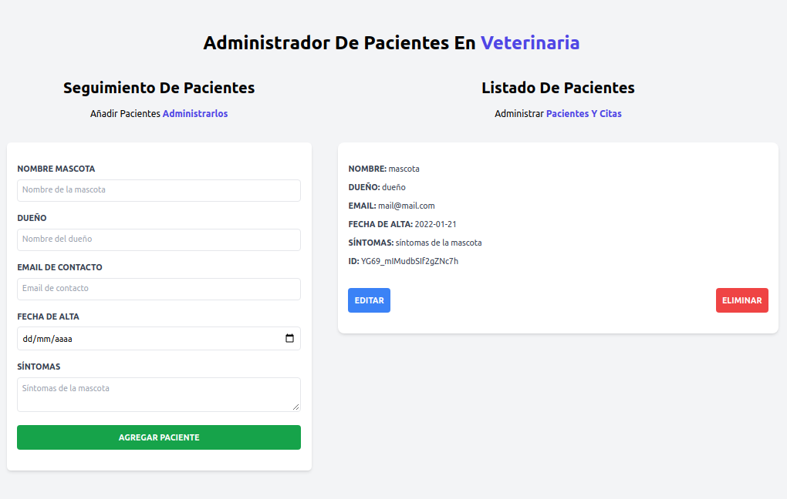

# Patients control




## Installation

### clone repo **(gh CLI)**
```
gh repo clone norbix14/react-patients-control patients
```
### folder
```
cd patients
```

### install dependencies
```
npm i
```

### run app (vite)
```
npm run dev
```

### build 
#### change port (default 3000): **-l** 3000|4000|5000
```
npm run build && serve -s -l 4000 dist/
```
